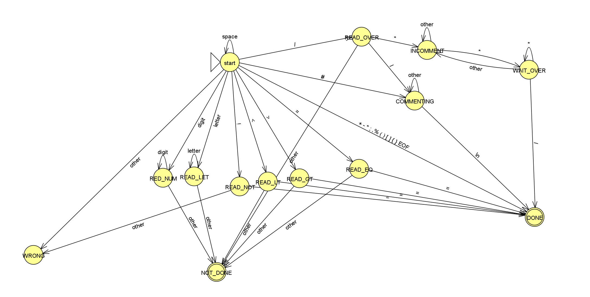

# compiler

### Group member

YU QIANSHUO : 1210027225 &nbsp;
WANG KUN : 1210025783 &nbsp;
ZHENG AO : 1220005554 &nbsp;

### Group member contribution
YU QIANSHUO : DFA implementation &nbsp;
WANG KUN : Scanner implementation &nbsp;
ZHENG AO : Token implementation &nbsp;

#### Compile
`g++ token.cpp dfa.cpp scanner.cpp -o scanner -std=c++17`

#### Run
`./scanner while_etc.pc`

### Features Implemented
- **Tokenization**: The program reads an input file and tokenizes the input text based on a predefined set of tokens.
- **Error Handling**: The program detects invalid tokens and prints an error message when an error state is encountered.

#### Scanner Implementation

1. **File Reading**:
   - The program can accept a command-line argument as the input file path and attempts to open the file.

2. **Scanner Initialization**:
   - The `Scanner` class is initialized with an input stream (in this case, a file stream) and stored as a member variable.

3. **Scanning Process**:
   - The `scan` method implements a loop that continuously reads characters from the input stream and calls the `Transition` function (implementation not provided).

4. **Error Handling**:
   - If an error state (`ERROR`) is encountered during scanning, the program prints an error message and terminates scanning early.

5. **End of Scanning**:
   - The scanning loop terminates when the end of the input stream (EOF) is reached.

6. **Token List Creation and Initialization**:
   - In the `main` function, a `Token` object and a `Token_List` object are created to store the tokens generated during the scanning process.

#### DFA Implementation

1. **DFA Initialization**:
   - The `DFA` class is initialized with a transition table and a set of accepting states.
   - The transition table is implemented as a 2D array of integers, where the row index represents the current state and the column index represents the input character.
2. **Transition Function**:
   - The `Transition` function takes a character as input and updates the current state of the DFA based on the transition table.
   - If the input character is not a valid transition for the current state, the function returns an error state (`ERROR`). Otherwise, it returns the next state.
3. **Accepting State Check**:
    - The `IsAccepting` function checks if the current state of the DFA is an accepting state.
    - If the current state is an accepting state, the function returns the corresponding token type. Otherwise, it returns an error state (`ERROR`).
    - The token type is an enum class that represents the different types of tokens that can be recognized by the DFA.
#### DFA Graph

#### Token Implementation
1. **Token Type Definition**:
   - The `TokenType` enum class defines the different types of tokens that can be recognized by the DFA.
   - The token types include keywords, identifiers, operators, separators, and literals.
   - The enum class also includes an `ERROR` type to represent invalid tokens.
2. **Token Structure**:
    - The `Token` struct stores the type and value of a token.
    - The type is of the `TokenType` enum class, and the value is a string representing the token value.
    - The struct also includes a `ToString` method to convert the token type to a string for printing.
    - The `Token` struct is used to store tokens generated during the scanning process.
    - The `Token_List` class stores a list of `Token` objects and provides methods to add tokens to the list and print the list.

